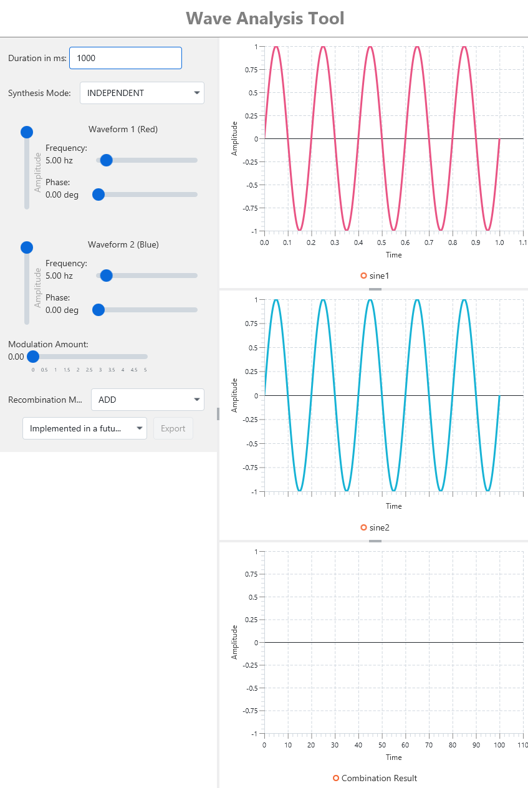

  

<h1>Wave Analysis Tool</h1>

### Visualization tool for analyzing waveforms and how they can affect each other in unpredictable, undetermined ways. In future versions you can export your waveforms to a wav file or a vector graphics extension for further analysis.

### Table of Contents

- [Run](#run)
- [Build](#build)
- [Usage](#usage)
    - [Synthesis Modes](#synth-mode)
- [To-do](#to-do)

## Run
If you have java 21 installed, it's very easy. Just download the executable jar file in the release section and run. 
It's on my to-do list to build platform dependent executables. Lower priority to be honest as the project currently needs many more features.

## Build
`mvn clean package`
You'll have an executable jar under [project-dir](./)/target

## Usage
As you can see in the below screenshot, you can have 3 different wavesforms on the right and interact with them with the controls on the left.  
You can change the frequency, amplitude, and phase of 2 of the waveforms. 3rd waveform is the result of applying different functions on the first 2. You can `add, multiply, subtract, divide` the first 2 waveforms and get the result in the 3rd waveform.   
Furthermore in the controls on the left, you can choose the duration of the waveform and the [Synthesis Mode](#synth-mode) for the upper 2 waveforms.  
Lastly, you also have a control for modulation amount which is not applicable for INDEPENDENT synthesis mode. Read more on that in the [Synthesis Mode](#synth-mode) section.  

  
Please keep in mind that the view resolution is much lower than calculation (500hz for view, 88200 for calculation). Due to that at high enough durations, you may see aliasing.  
Here's a video documenting the app usage:

[Wave Analysis Tool Usage](./github-assets/app_usage_recording.mp4)

### Synthesis Modes
| Mode                         | Description                                                                                 |
|------------------------------|---------------------------------------------------------------------------------------------|
| INDEPENDENT                  | Waveforms are independent of each other. No modulation is applied.                          |
| CHAOS_TWO_WAY_FM             | Waveforms modulate each other by frequency. In the future AM and maybe PM will be added.    |
|CHAOS_INDEPENDENT_SELF_MOD_FM | Waveforms modulate themselves by frequency.                                                 |
|FM_WAVE1MOD_WAVE2CARRIER      | Waveform 1 is modulator that modulates the frequency of waveform 2 (carrier).               |
 

## To-Do
| Prio | Description                                                                                     |
|------|-------------------------------------------------------------------------------------------------|
| 1    | Left/Right navigation for the waveform vi                                                       |
| 2    | Implement the button for export. Vector graphics. Only the resulting waveform                   |
| 3    | Add a control for changing waveform type (Currently only Sinusoidal)                            |
| 4    | Add hover on charts to show details about points as you hover over them                         |
| 5    | Option for internal sample rate. View resolution will be the same in light of performance       |
| 6    | Add wav file export functionality                                                               |
| 7    | Add a 256 frame navigator for simple waveforms where FFT is possible (Not chaos)                |
| 8    | Add formula export functionality with an estimate on periodicity. Needs multiple stages of FFT  |
| 9    | Optimize for extreme sample rates needed for chaos waveforms                                    |
| 10   | Implement algorithm to negate CPU Cycle effect on initial waveform conditions (Chaos Synthesis) |
